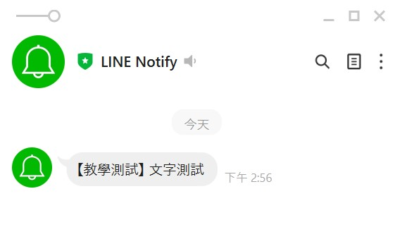
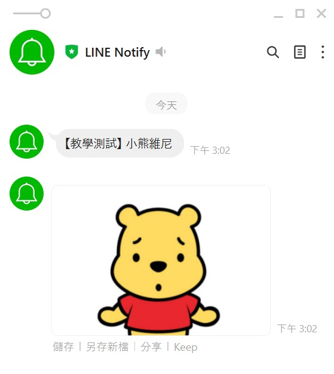
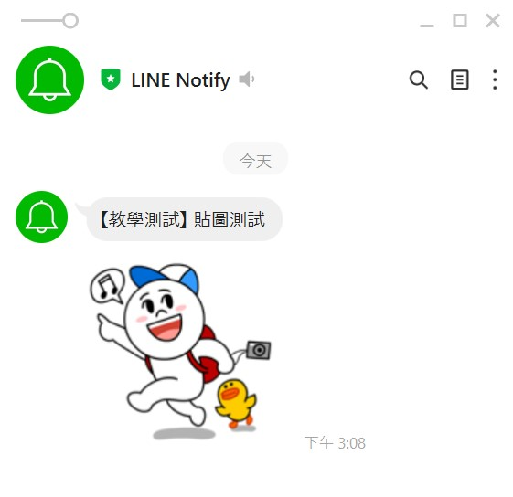

# **Notify Project**

## **專案說明**
 藉由Line Notify功能，以撰寫物件導向格式撰寫，連線上傳文字訊息、本地端圖片、網路圖片、Line貼圖。

 

## **環境說明**
 Windows 10 家用版；
 Python version 3.6.8

 

## **檔案說明**
 notify.py 撰寫內容
 image 存放本地端圖片的資料夾
 

## **成果說明**
 使用Line Notify上傳文字訊息

使用Line Notify上傳文字訊息與本地端圖片

使用Line Notify上傳文字訊息和網路圖片

使用Line Notify上傳文字訊息和貼圖

